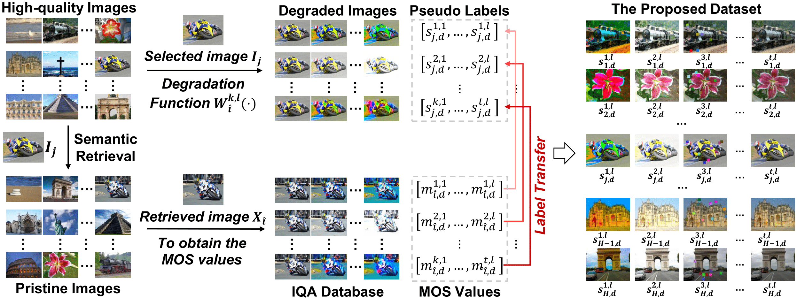
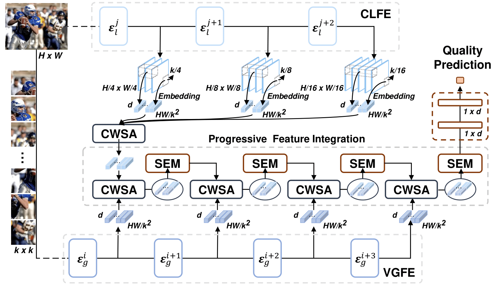

<h2 align="center">
No-Reference Image Quality Assessment with Global-Local Progressive Integration and Semantic-Aligned Quality Transfer
</h2>


## Overview
This repository contains the implementation of **GlintIQA** and the
**Semantic-Aligned Quality Transfer (SAQT)** dataset creation pipeline.

### 📊 Dataset Creation Pipeline
<details>
<div align="center">
  
</div>
</details>

### 🧠 GlintIQA Framework
<details>
<div align="center">
  
</div>
</details>

## Repository Structure

```text
.
+-- glintiqa/                  # Core model, engine, data wrappers, configs
|   +-- models/                # GlintIQA, VGFE, CLFE, CWSA, SIEM
|   +-- engine/                # Training, evaluation, metrics, checkpoints
|   +-- data/                  # Dataset classes, transforms, splits, dataloaders
|   +-- configs/               # Default command-line configuration
+-- dataset_generation/        # SAQT-IQA dataset generation pipeline
+-- scripts/                   # Training and evaluation entry points
+-- configs/                   # Example dataset path configuration
+-- timm/                      # Local timm dependency copy
```

## Dataset Configuration

Prepare IQA datasets in your local filesystem, then copy and edit the example
path config:

Example dataset roots:

```yaml
datasets:
  live: /path/to/LIVE
  csiq: /path/to/CSIQ
  tid2013: /path/to/TID2013
  kadid-10k: /path/to/kadid10k
  saqt-iqa: /path/to/SAQT_IQA
```

Current command-line scripts accept dataset paths directly through
`--dataset-root`.

## SAQT-IQA Dataset Generation

The cleaned SAQT-IQA generation pipeline is under `dataset_generation/`.

The details are available in [dataset_generation/README.md](dataset_generation/README.md).

## Training

Single-dataset training entry point:

```bash
python scripts/train.py \
  --model glintiqa \
  --dataset live \
  --dataset-root /path/to/LIVE \
  --output-dir ./outputs/live_glintiqa \
  --epochs 300 \
  --batch-size 32 \
  --train-test-round 10 \
  --learning-rate 1e-5
```

Important options:

- `--model`: model name, currently `glintiqa`
- `--dataset`: dataset name, such as `live`, `csiq`, `tid2013`, `kadid-10k`
- `--dataset-root`: root path of the selected IQA dataset
- `--resume`: optional checkpoint path
- `--test-patch-num`: number of test patches per image

## Evaluation

Evaluate a checkpoint:

```bash
python scripts/evaluate.py \
  --model glintiqa \
  --dataset live \
  --dataset-root /path/to/LIVE \
  --resume ./outputs/live_glintiqa/checkpoints/live_best.pth \
  --output-dir ./outputs/eval_live
```

The evaluation script reports SROCC, PLCC, KRCC, and RMSE, and saves prediction
results to a CSV file.

## Cross-Dataset Testing

Cross-dataset evaluation entry point:

```bash
 python scripts/cross_dataset.py \
     --train-dataset kadid-10k \
     --train-dataset-root /path/to/kadid10k \
     --test-datasets live csiq tid2013 \
     --test-dataset-roots /path/to/LIVE /path/to/CSIQ /path/to/TID2013 \
     --output-dir ./outputs/cross_kadid \
     --epochs 200 \
     --batch-size 32 \
     --eval-batch-size 32
```

## Pretraining SAQT dataset

```bash
  torchrun --nproc_per_node=4 scripts/train_distributed.py \
    --dataset-root /path/to/SAQT_IQA/images \
    --label-path /path/to/SAQT_IQA/labels \
    --similarity-csv /path/to/similarity_img_in_kadid-10k_resnet101.csv \
    --output-dir ./outputs/pretrain_saqt \
    --epochs 50 \
    --batch-size 128 \
    --val-size 1000 \
    --amp

  # If you need to run additional tests on KADID-10K, you can explicitly specify:
  --test-dataset kadid-10k \
  --test-dataset-root /path/to/kadid10k \
  --test-every 5
```

## 📖 Citation

If you find our work useful or relevant to your research, please cite our paper:

```bibtex
@article{wang2026glintiqa,
author = {Wang, Xiaoqi and Zhang, Yun},
title = {Global-Local Progressive Integration and Semantic-Aligned Quality Transfer for No-Reference Image Quality Assessment},
year = {2026},
publisher = {Association for Computing Machinery},
address = {New York, NY, USA},
issn = {1551-6857},
url = {https://doi.org/10.1145/3815779},
doi = {10.1145/3815779},
journal = {ACM Trans. Multimedia Comput. Commun. Appl.},
month = may
}

@article{wang2024glintiqa,
  title={No-reference image quality assessment with global-local progressive integration and semantic-aligned quality transfer},
  author={Wang, Xiaoqi and Zhang, Yun},
  journal={arXiv preprint arXiv:2408.03885},
  year={2024}
}
